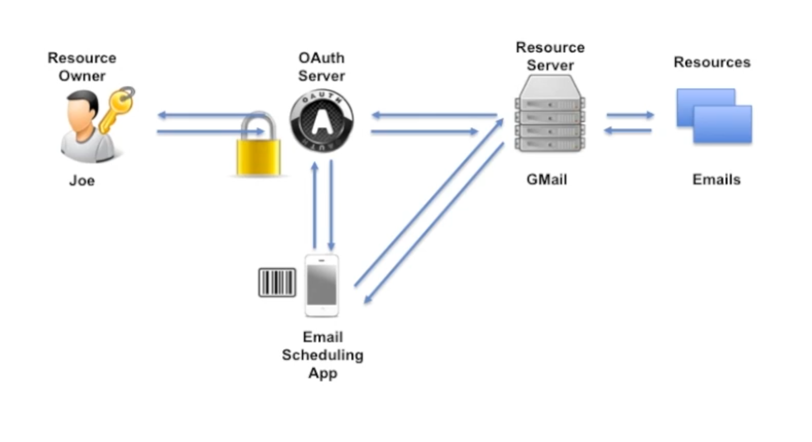
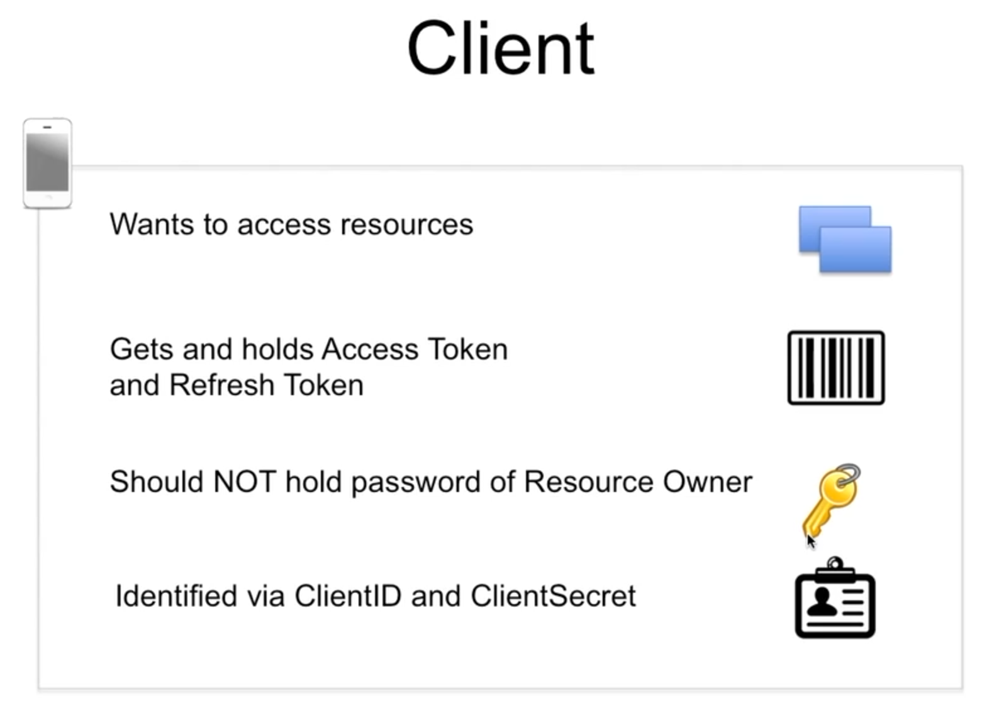
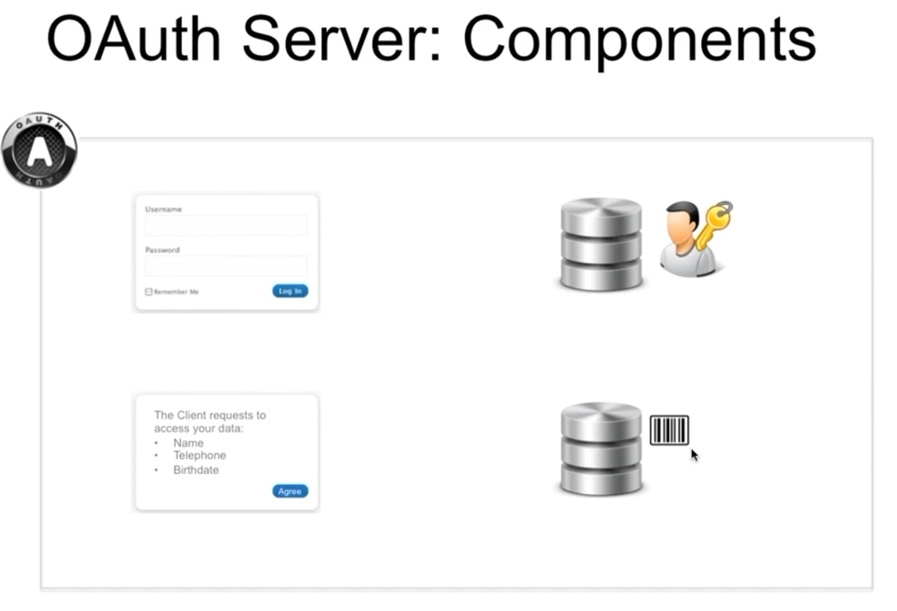
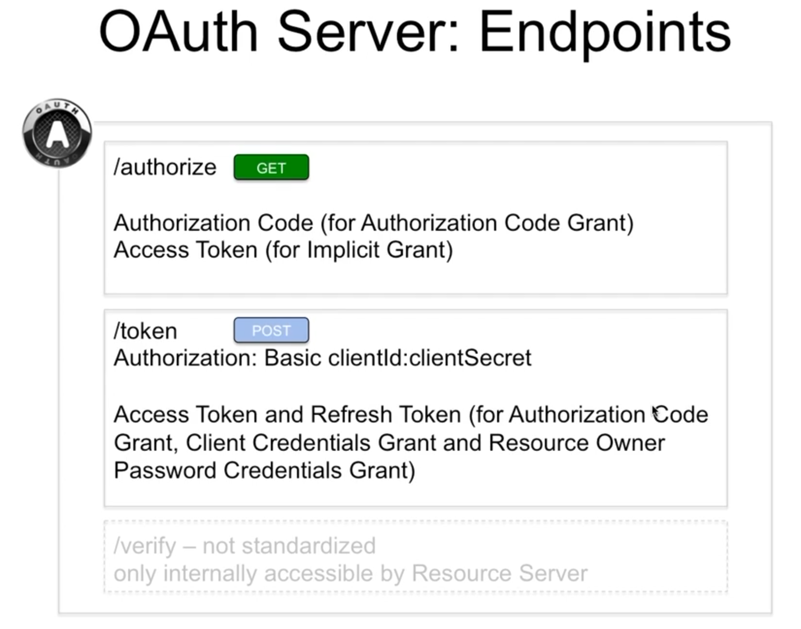
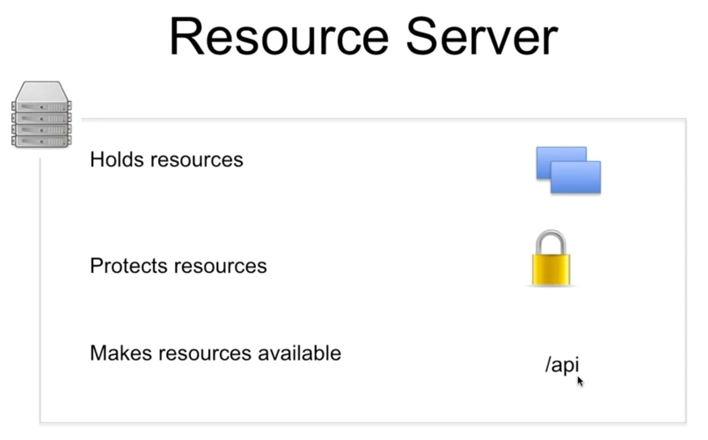
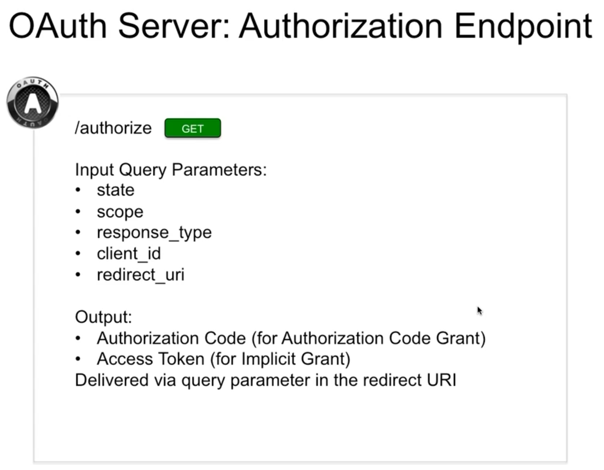
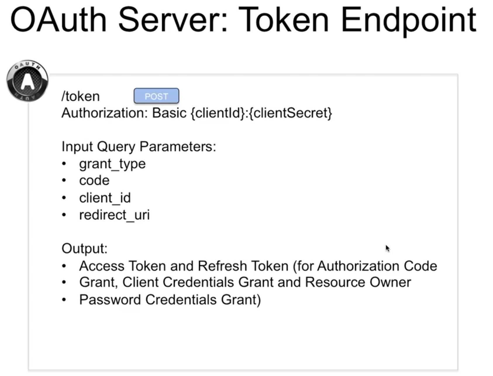
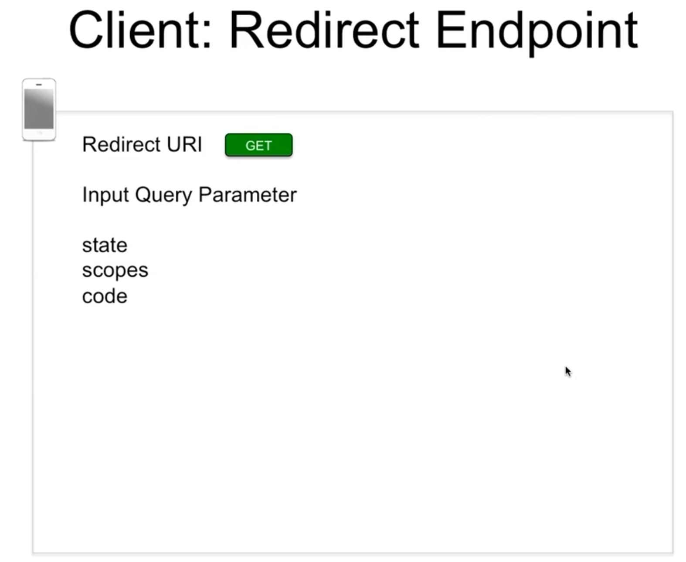
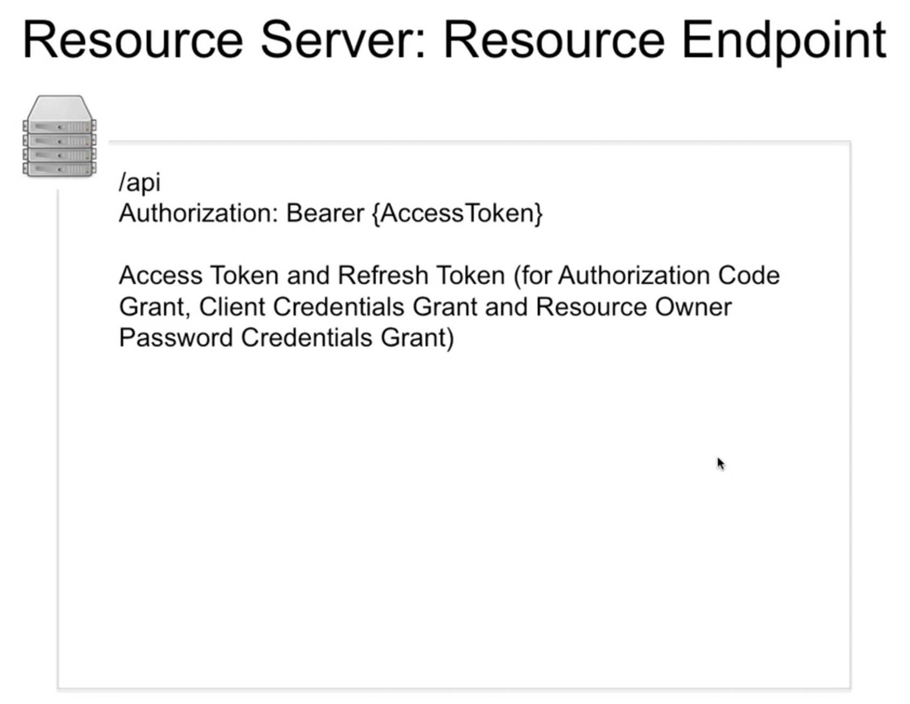

## Password Anti-pattern

The Password Anti-Pattern, in which a shared secret (the password) directly represents the party in question (the user). By sharing this secret password with applications, the user enables applications to access protected APIs.

## OAuth 2.0

OAuth 2 is a standard for delegating authorization for accessing resources via HTTP.

OAuth 2 is specified and standardized by the IETF in RFC6749.

[http://tools.ietf.org/html/rfc6749](http://tools.ietf.org/html/rfc6749)

## OAuth Actors

- OAuth provider has the following 3 components
    - Authentication Component
    - Concent Server
    - Token management infrastructure
- Resource provider (hosts user's data)
- Resource owner (User)
- Client (Application)
    - Wants to access resources
    - Gets and holds Access Token and Refresh Token
    - Should not hold password of Resource Owner
    - Identified via ClientID and ClientSecret

## OAuth Endpoints

    - Authorization Endpoint
    - Token Endpoint
    - Redirect Endpoint
    - Resource Endpoint

