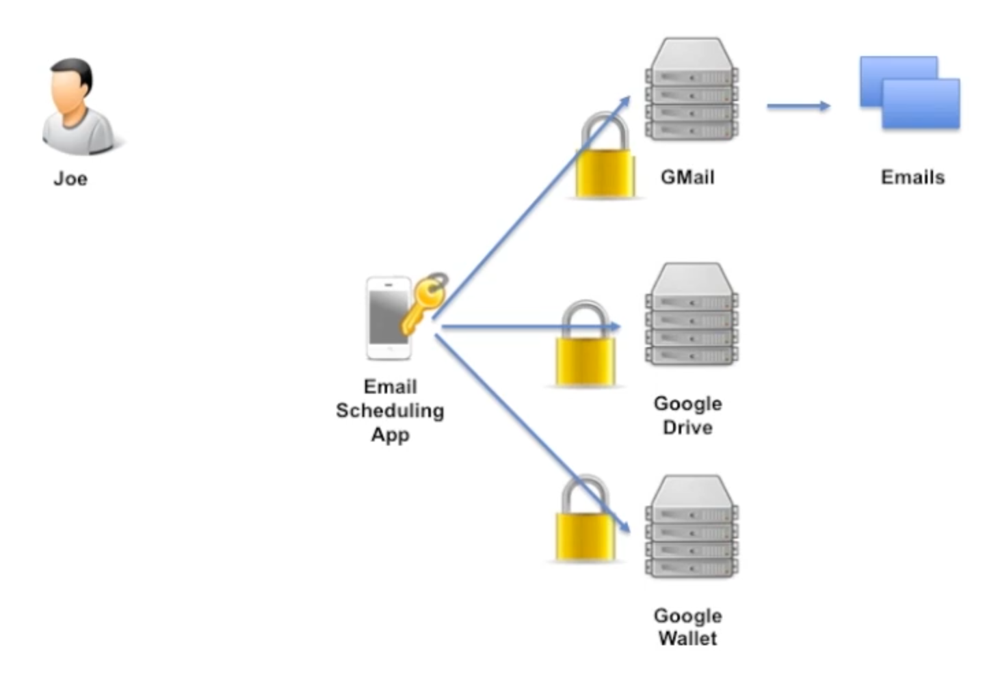

## Password Anti-pattern

The Password Anti-Pattern, in which a shared secret (the password) directly represents the party in question (the user). By sharing this secret password with applications, the user enables applications to access protected APIs.

